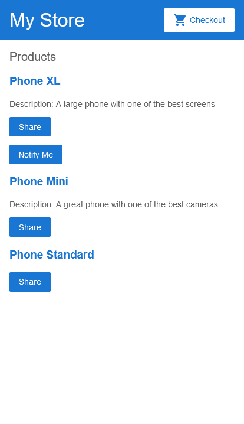
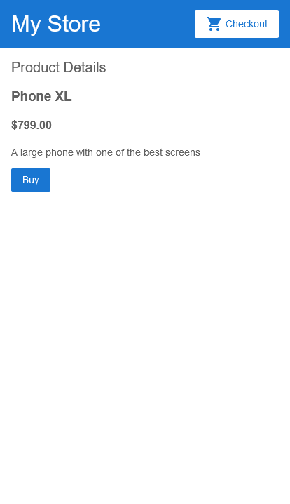
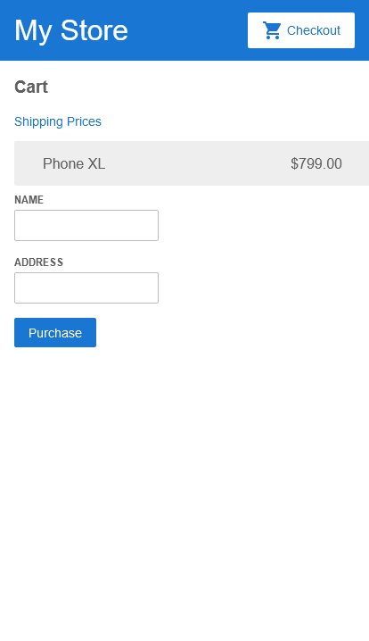
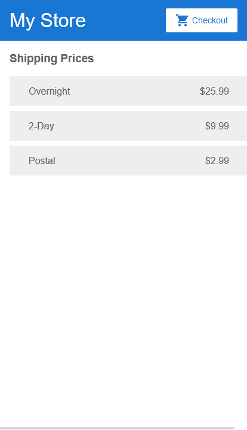

<p align="center">
  
</p>

<h1 align="center">My Store Angular</h1>
<p align="center">This E-Commerce was made based on the introductory tutorial of the official Angular documentation. </p>

<h3 align="center">

  <a href="./LICENSE" target="_blank">
    
  </a>

</h3>

<br />

<p align="center">
    
    
    
    
</p>

<br />

# Techs

-  Less
-  Angular
-  rxjs

## Installation of dependencies and local use

<br />

>> ### [Documentation Angular](https://angular.io/start)
<br />
> Create somewhere on your pc, a folder to create a copy of the repository, inside it open command terminal and type the commands below:

```
git clone https://github.com/AlanWehrliLC/my-store-angular.git
cd my-store-angular
npm install
npm run start
```

<br />

> Test the app web
>>#### [My Store Angular](https://my-store-angular.vercel.app/)